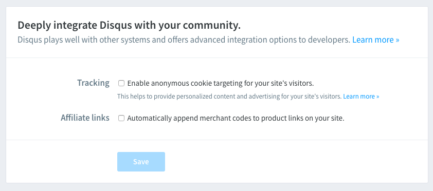

hero_title: Kebijakan Privasi
hero: Data apa yang kami kumpulkan?

# Privasi

!!! info
    Halaman ini terakhir diubah pada: 09 Mei 2019 23:23 WIB. Silahkan lihat perubahan yang terjadi
    terhadap halaman ini [disini]().

Kita peduli dengan privasi di Internet, namun untuk menjalankan situs ini, kita menggunakan 4
layanan pihak ketiga, antara lain:

- [Google Analytics](https://analytics.google.com) (untuk analitik)
- [Google Fonts CDN](https://fonts.google.com) (untuk memuat font custom)
- [Disqus](https://disqus.com) (untuk komentar)
- [Zeit Now](https://zeit.co/now) (untuk hosting)
- [CodeSandbox](https://codesandbox.io) (untuk demo)

Setiap layanan tersebut memiliki kebijakan privasinya masing-masing, yang mana bisa diakses di:

- [Google Analytics](https://www.google.com/analytics/terms/us.html)
- [Google Fonts CDN](https://developers.google.com/fonts/faq#what_does_using_the_google_fonts_api_mean_for_the_privacy_of_my_users)
- [Disqus](https://help.disqus.com/terms-and-policies/disqus-privacy-policy)
- [Zeit Now](https://zeit.co/privacy)
- [CodeSandbox](https://codesandbox.io/legal/privacy)

Kita melakukan tracking disini agar mengetahui:

- Total tayang halaman per-waktu
- Topik yang memiliki komentar/vote
- Lokasi geografis yang paling populer
- Perangkat pengguna yang digunakan (Desktop/tablet/mobile)

Untuk:

- Mengukur metriks untuk refleksi terhadap "goals" kami
- Mengetahui feedback dari pengunjung via komentar
- Optimasi performa (network-level). Setiap geografis memiliki kecepatan internet berbeda-beda
- Optimasi performa (application-level). Setiap perangkat memiliki mesin berbeda-beda. Yang artinya,
    setiap perangkat memiliki waktu yang beragam untuk mengeksekusi 77kb kode JavaScript.

Kita disini tidak mengumpulkan data khusus apapun kecuali data yang dikumpulkan oleh 4 layanan
tersebut. Jika kalian tidak ingin diri kalian di "lacak", silahkan gunakan [Privacy
Badger](https://www.eff.org/privacybadger) yang dibuat oleh Electronic Frontier Foundation yang
berarti _secara tidak langsung_ tidak ikut andil dalam membuat situs ini menjadi lebih baik lagi.

Juga, kita tidak "mencentang" _anonymous cookie targeting_ di Disqus, yang berarti, seharusnya
privasi anda lebih aman disini. Karena well, kita tidak menggunakan fitur "recommendation" atau
"personalized" content yang ditawarkan oleh Disqus.

